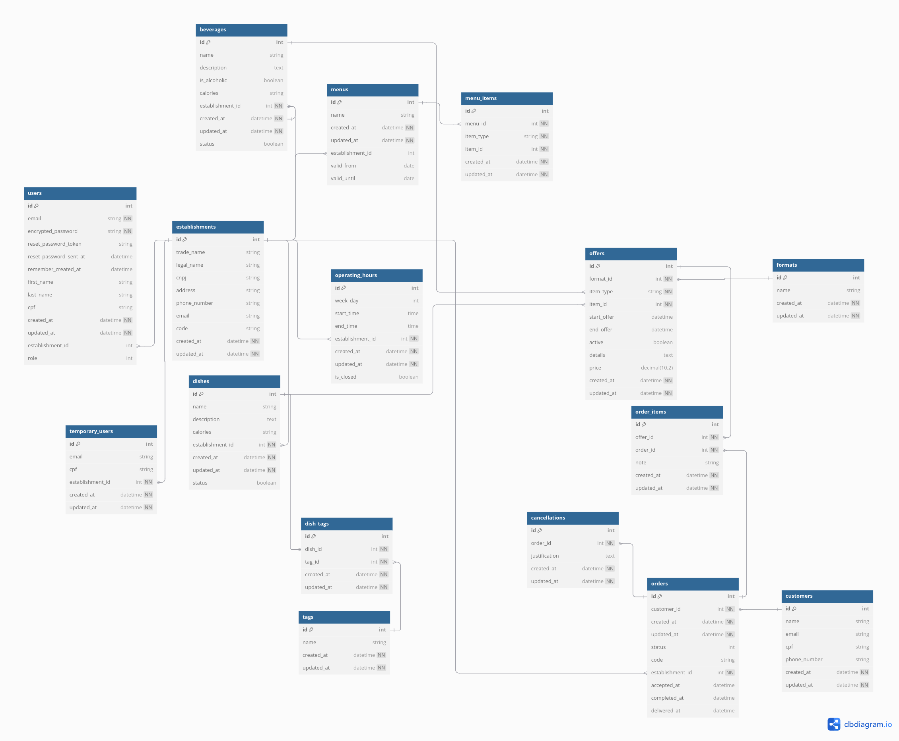

#  Rails "Pá Levá"  

 <h2>Visão Geral</h2> 

Este projeto é está sendo desenvolvido como requisito avaliativo do programa <a href="https://treinadev.com.br/">Treina Dev</a> da <a href="https://www.campuscode.com.br/">Campus Code</a>. O projeto consiste num **Sistema de Gerenciamento de Estabelecimentos que Comercializam Alimentos** desenvolvido com Ruby on Rails.

 <h2>Estrutura do banco de dados<h2> 

 <h2>Gems Utilizadas</h2> 

- Devise
A gem devise é utilizada para a autenticação de usuários e controle de acesso às rotas.

- Active Storage (Gerenciamento de Arquivos)
A aplicação também utiliza o Active Storage para fazer upload e gerenciamento de arquivos, como imagens de comidas e bebidas.

